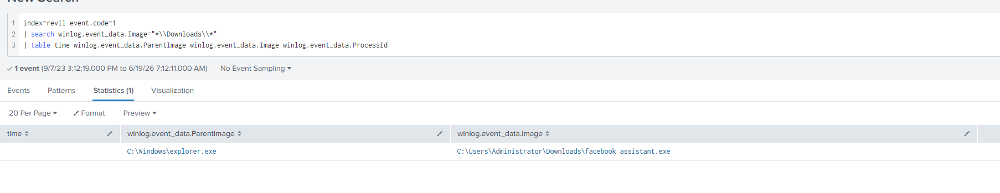
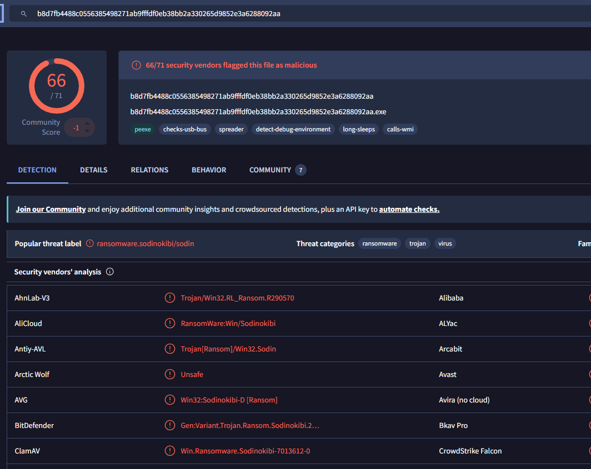

# REvil Investigation

> Portfolio-style ransomware investigation walkthrough based on the CyberDefenders REvil lab.

`Splunk` `DFIR` `Ransomware` `Threat Intel`

---

## Project Summary

This project documents a REvil ransomware investigation using Windows event telemetry and external threat intelligence. The objective was to trace the attack from the ransom note back to the malware, identify anti-recovery behavior, validate the sample hash, and extract attacker infrastructure.

## Scenario

The investigation starts with evidence of ransomware activity on a Windows host. From there, the workflow follows the artifacts left behind by the malware to identify:

- the ransom note filename
- the responsible process ID
- the executable path
- the recovery-disruption command
- the SHA256 hash
- the associated onion domain

## Tools Used

- Splunk
- CyberChef
- VirusTotal
- ANY.RUN

## Skills Demonstrated

- Splunk log analysis
- Windows event investigation
- Process tracing
- Base64 decoding
- IOC extraction
- Threat intelligence validation
- Detection-oriented thinking

## Key Findings

- The ransomware dropped the note `5uizv5660t-readme.txt`
- The process linked to the activity was `5348`
- The executable ran from `C:\Users\Administrator\Downloads\facebook assistant.exe`
- The malware attempted to delete shadow copies with PowerShell
- The SHA256 hash matched a known malicious sample
- DNS-related intelligence revealed the operator onion domain

---

## Walkthrough

### Question 1

**Objective:** Identify the filename of the ransom note left by the ransomware.

**Query**

```spl
index=revil event.code=11
| search winlog.event_data.TargetFilename="*\\Downloads\\*"
| table time winlog.event_data.TargetFilename winlog.event_data.ProcessId winlog.event_data.User
```

**Evidence**


**Answer**

`5uizv5660t-readme.txt`

**Explanation**

The same text file appears in multiple `Downloads` folders, which shows it is the ransom note dropped by the malware.

---

### Question 2

**Objective:** Find the process ID linked to the ransom note creation.

**Query**

```spl
index=revil event.code=11
| search winlog.event_data.TargetFilename="*\\Downloads\\*"
| table time winlog.event_data.TargetFilename winlog.event_data.ProcessId winlog.event_data.User
```

**Evidence**


**Answer**

`5348`

**Explanation**

The ransom note creation events all point to the same process ID, so `5348` is the process behind that activity.

---

### Question 3

**Objective:** Locate the ransomware executable on disk.

**Query**

```spl
index=revil event.code=1
| search winlog.event_data.Image="*\\Downloads\\*"
| table time winlog.event_data.ParentImage winlog.event_data.Image winlog.event_data.ProcessId
```

**Evidence**



**Answer**

`C:\Users\Administrator\Downloads\facebook assistant.exe`

**Explanation**

The `Image` field shows the suspicious executable launched from the `Downloads` folder.

---

### Question 4

**Objective:** Identify the command used to disrupt recovery.

**Query**

```spl
index=revil event.code=1
| search winlog.event_data.CommandLine="*-e*"
| table time winlog.event_data.ParentImage winlog.event_data.Image winlog.event_data.ProcessId winlog.event_data.ParentCommandLine winlog.event_data.CommandLine
```

**Evidence**


**Answer**

```powershell
Get-WmiObject Win32_Shadowcopy | ForEach-Object {$_.Delete();}
```

**Explanation**

The ransomware used an encoded PowerShell command to delete Volume Shadow Copies and make recovery harder.

---

### Question 5

**Objective:** Extract the SHA256 hash of the ransomware executable.

**Query**

```spl
index=revil event.code=1 "facebook assistant.exe"
| table _time winlog.event_data.Hashes
| dedup winlog.event_data.Hashes
```

**Evidence**




**Answer**

`b8d7fb4488c0556385498271ab9fffdf0eb38bb2a330265d9852e3a6288092aa`

**Explanation**

This hash matches the ransomware sample and can be validated in VirusTotal for known detections.

---

### Question 6

**Objective:** Identify the ransomware author's onion domain.

**Method**

Check sandbox or threat intelligence results and review DNS activity for suspicious `.onion` domains.

**Evidence**


**Answer**

`aplebzu47wgazapdqks6vrcv6zcnjppkbxbr6wketr56nf6aq2nmyoyd.onion`

**Explanation**

The DNS results show a Tor hidden service domain, which is likely part of the ransomware operator's infrastructure.

---

## Final Answers

| Question | Answer |
| --- | --- |
| Ransom note filename | `5uizv5660t-readme.txt` |
| Process ID | `5348` |
| Executable path | `C:\Users\Administrator\Downloads\facebook assistant.exe` |
| Recovery disruption command | `Get-WmiObject Win32_Shadowcopy \| ForEach-Object {$_.Delete();}` |
| SHA256 hash | `b8d7fb4488c0556385498271ab9fffdf0eb38bb2a330265d9852e3a6288092aa` |
| Onion domain | `aplebzu47wgazapdqks6vrcv6zcnjppkbxbr6wketr56nf6aq2nmyoyd.onion` |

---

## Detection Files

- Splunk rule: [REvil/detections/revil-ransom-note.spl](REvil/detections/revil-ransom-note.spl)
- Sigma rule: [REvil/detections/revil-ransom-note.yml](REvil/detections/revil-ransom-note.yml)

## What This Demonstrates

- Ability to move from host artifacts to attacker context
- Practical use of Splunk for forensic-style investigation
- Clear documentation of findings and evidence
- Translation of lab findings into reusable detections
