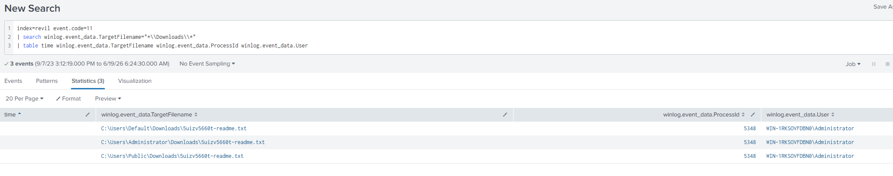
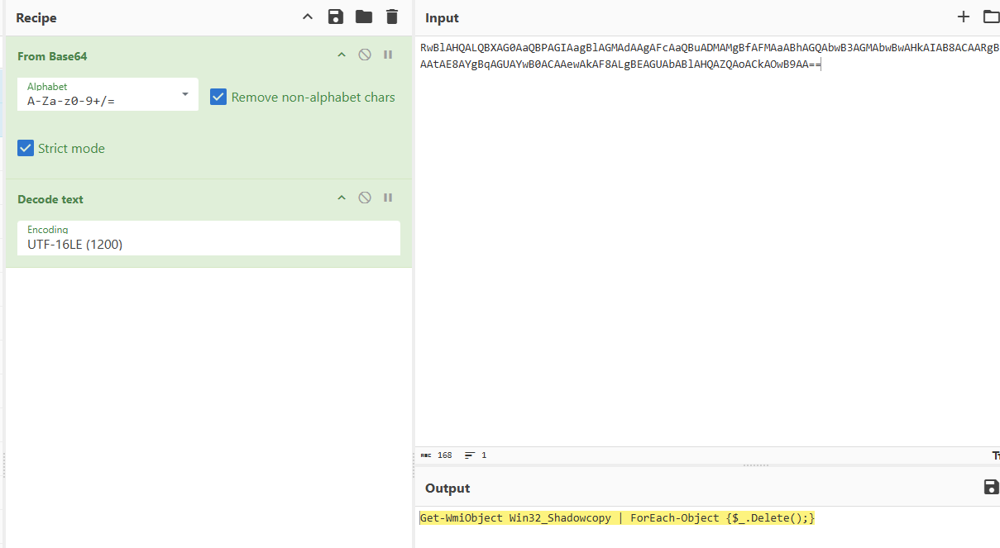

# CyberDefenders REvil Walkthrough

## Overview

This lab focuses on investigating a REvil ransomware infection using Splunk and threat intelligence tools. The goal is to trace the ransomware from the ransom note back to the executable, identify the actions it took on the system, and collect useful indicators of compromise.

## Scenario

In this investigation, we are working through evidence linked to a ransomware incident. We need to identify the ransom note, trace the process behind it, locate the malware, and collect key indicators such as the deletion command, file hash, and attacker infrastructure.

## Skills Demonstrated

- Splunk log analysis
- File creation investigation
- Process tracing
- PowerShell command review
- Base64 decoding with CyberChef
- Malware hash validation
- Threat intelligence correlation
- IOC identification

## Walkthrough

### Question 1

#### Objective

Find the filename of the ransom note dropped by the malware.

#### Query

```spl
index=revil event.code=11
| search winlog.event_data.TargetFilename="*\\Downloads\\*"
| table time winlog.event_data.TargetFilename winlog.event_data.ProcessId winlog.event_data.User
```

#### Evidence



#### What to look for

Review the `TargetFilename` field and look for a text file created in multiple `Downloads` folders.

#### Answer

`5uizv5660t-readme.txt`

#### Why it matters

Ransomware commonly drops a ransom note in user-accessible folders. Finding this file gives us an early indicator of compromise and helps us link later events back to the same attack.

### Question 2

#### Objective

Identify the process ID responsible for creating the ransom note.

#### Query

```spl
index=revil event.code=11
| search winlog.event_data.TargetFilename="*\\Downloads\\*"
| table time winlog.event_data.TargetFilename winlog.event_data.ProcessId winlog.event_data.User
```

#### Evidence


#### What to look for

Check the `ProcessId` value that appears next to the ransom note creation events.

#### Answer

`5348`

#### Why it matters

Once we know the process ID, we can pivot into process creation events and trace the malware back to its source executable.

### Question 3

#### Objective

Locate the ransomware executable on disk.

#### Query

```spl
index=revil event.code=1
| search winlog.event_data.Image="*\\Downloads\\*"
| table time winlog.event_data.ParentImage winlog.event_data.Image winlog.event_data.ProcessId
```

#### Evidence


#### What to look for

Focus on the `Image` field and look for a suspicious executable launched from the `Downloads` folder.

#### Answer

`C:\Users\Administrator\Downloads\facebook assistant.exe`

#### Why it matters

This tells us exactly where the ransomware was executed from. That path can be used for scoping, containment, and future detections.

### Question 4

#### Objective

Identify the command the ransomware used to interfere with recovery.

#### Query

```spl
index=revil event.code=1
| search winlog.event_data.CommandLine="*-e*"
| table time winlog.event_data.ParentImage winlog.event_data.Image winlog.event_data.ProcessId winlog.event_data.ParentCommandLine winlog.event_data.CommandLine
```

#### Evidence




#### What to look for

Look for PowerShell launched with the `-e` switch, which suggests an encoded command. Copy the encoded value into CyberChef, decode it with `From Base64`, and then decode the text as `UTF-16LE`.

#### Answer

```powershell
Get-WmiObject Win32_Shadowcopy | ForEach-Object {$_.Delete();}
```

#### Why it matters

This command deletes Volume Shadow Copies, which removes an easy recovery option for the victim. This is a common ransomware tactic.

### Question 5

#### Objective

Extract the SHA256 hash of the ransomware executable.

#### Query

```spl
index=revil event.code=1 "facebook assistant.exe"
| table _time winlog.event_data.Hashes
| dedup winlog.event_data.Hashes
```

#### Evidence


#### What to look for

Find the `SHA256` value in the `Hashes` field, then verify it in VirusTotal or another threat intel source.

#### Answer

`b8d7fb4488c0556385498271ab9fffdf0eb38bb2a330265d9852e3a6288092aa`

#### Why it matters

The SHA256 hash lets defenders match the sample against known detections, threat intel, blocklists, and malware databases.

### Question 6

#### Objective

Identify the ransomware operator's onion domain.

#### Threat Intel Method

Use the sample or its hash in a sandbox or threat intelligence tool and inspect network and DNS activity.

#### Evidence


#### What to look for

Look for suspicious `.onion` domains in DNS or network activity tied to the sample.

#### Answer

`aplebzu47wgazapdqks6vrcv6zcnjppkbxbr6wketr56nf6aq2nmyoyd.onion`

#### Why it matters

Hidden service domains are often used by ransomware operators for payment portals, negotiation, or backend infrastructure.

## Analyst Notes

- The investigation starts with a simple artifact, the ransom note, and then pivots into process and execution data.
- The process ID made it possible to move from file creation activity to the malware's executable path.
- The encoded PowerShell command confirmed that the attacker attempted to delete shadow copies, which is consistent with ransomware behavior.
- The SHA256 hash gave a strong pivot into external intelligence sources and confirmed the sample as malicious.
- The onion domain provided attacker infrastructure that could be used for threat hunting and IOC enrichment.

## Final Answers

| Question | Answer |
| --- | --- |
| Ransom note filename | `5uizv5660t-readme.txt` |
| Ransomware process ID | `5348` |
| Executable path | `C:\Users\Administrator\Downloads\facebook assistant.exe` |
| Recovery disruption command | `Get-WmiObject Win32_Shadowcopy \| ForEach-Object {$_.Delete();}` |
| SHA256 hash | `b8d7fb4488c0556385498271ab9fffdf0eb38bb2a330265d9852e3a6288092aa` |
| Onion domain | `aplebzu47wgazapdqks6vrcv6zcnjppkbxbr6wketr56nf6aq2nmyoyd.onion` |

## Key Takeaways

- Start with the most visible artifact and pivot from there.
- Process IDs are useful for linking file activity to execution events.
- Encoded PowerShell should always be investigated carefully.
- Hashes and infrastructure indicators help connect local evidence to external threat intelligence.
- A simple and documented workflow makes both investigation and reporting much easier.
